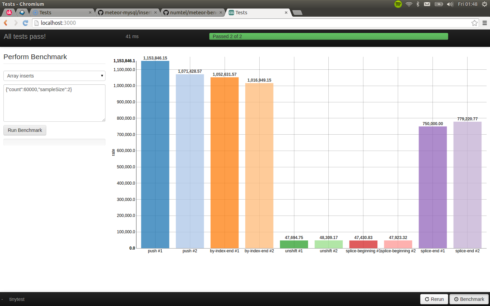

# numtel:benchmark-packages

Perform benchmarks on your Meteor packages while using the `meteor --test-packages` browser interface



Click on the 'Benchmark' button added to the interface, or press `F2`, to toggle the benchmark overlay.

Select a test and specify options use JSON. Also, raw results are presented in the browser's Javascript console.

* [View source for Array insert benchmark...](test/arrayInserts.js)

## Installation

Add the following lines to `package.js`:
```javascript

Package.onTest(function(api) {
  // ...
  api.use('tinytest');

  // Add the pacakge
  api.use('numtel:benchmark-packages@0.0.1');
  
  // Benchmarks are only available on the client
  api.addFiles([
    'test/arrayInserts.js'
  ], 'client');
});
```

## Defining benchmarks

Define each benchmark using the following syntax. Each case has meta values prefixed with underscore as well as methods.

```javascript
Benchmark.addCase({
  _label: 'My test', // Human readable name
  _value: 'rate', // (Optional, default 'rate') Value to display on graph
  _default: { // Specify default options (must be JSON-serializable)
    count: 50000, // (Optional, default 1) How many items to insert
    sampleSize: 4 // (Required) Number of times to run each test
  },
  // Provide each method to test
  'original-method': {
    // The main function to be timed
    run: function(options,done){
      // Perform operation...
      done();
    },
    reset: function(options, done){
      // Clean up... this runs before and after 'run'
      done();
    }
  },
  'new-method': { ... }
});
```
`_value` Setting | Description
---------|---------------
`rate`   | (Default) Operations per second (based on `count`)
`time`   | Total time elapsed (milliseconds)
`resetTime` | Time elapsed during clean-up
*Custom* | Any other value except `name` or `count`

* Custom time points may also be graphed. Specify a partial-completion with a string argument in the `done()` function (e.g.: `done('server')`) then use the same argument for `_value`. `done()` with no arguments must still be called later.
* `run` and `reset` functions run asynchronously until `done()` is called.
* `count`, `sampleSize`, and `methods` are reserved option names.

When configuring a benchmark to run in the browser, pass a `methods` option containing an array of strings corresponding to the names of methods to test in order to run only a subset of methods in benchmark.

## License

MIT
